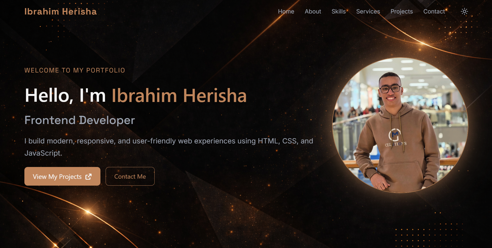
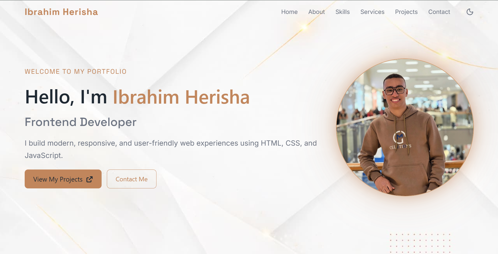
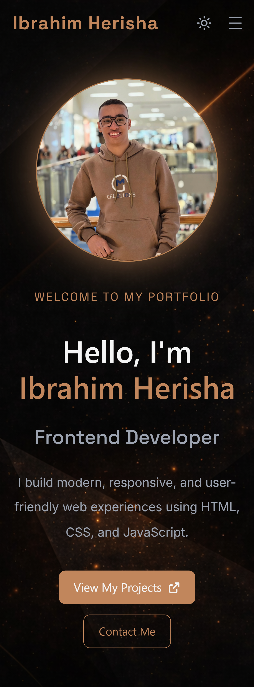
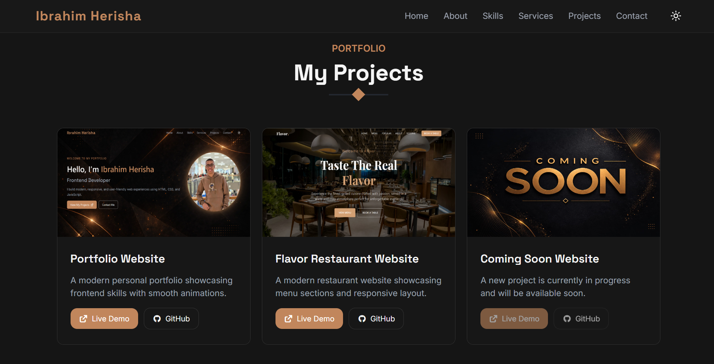

# Ibrahim Herisha Portfolio

A modern responsive portfolio website built with **HTML, CSS, and JavaScript** to showcase my projects and frontend development skills.

---

## 🚀 Live Demo
🔗 https://ibrahimherisha.github.io/portfolio-website/

---

## 💻 Repository
🔗 https://github.com/ibrahimherisha/portfolio-website

---

## 🛠 Technologies Used

- HTML5
- CSS3
- JavaScript
- Bootstrap
- Font Awesome

---

## ✨ Features

- Responsive design for all devices
- Dark / Light mode
- Smooth animations
- Modern UI design
- Mobile navigation menu
- Projects showcase section

---

## 📸 Screenshots

### Hero Section (Dark Mode - Desktop)

---

### Hero Section (Light Mode - Desktop)

---

### Hero Section (Mobile)

---

### Projects Section

---

## 👨‍💻 Author

**Ibrahim Herisha**

Frontend Developer

- GitHub: https://github.com/ibrahimherisha
- LinkedIn: https://www.linkedin.com/in/ibrahim-herisha-542075229/

---

© 2026 Ibrahim Herisha. All rights reserved.
